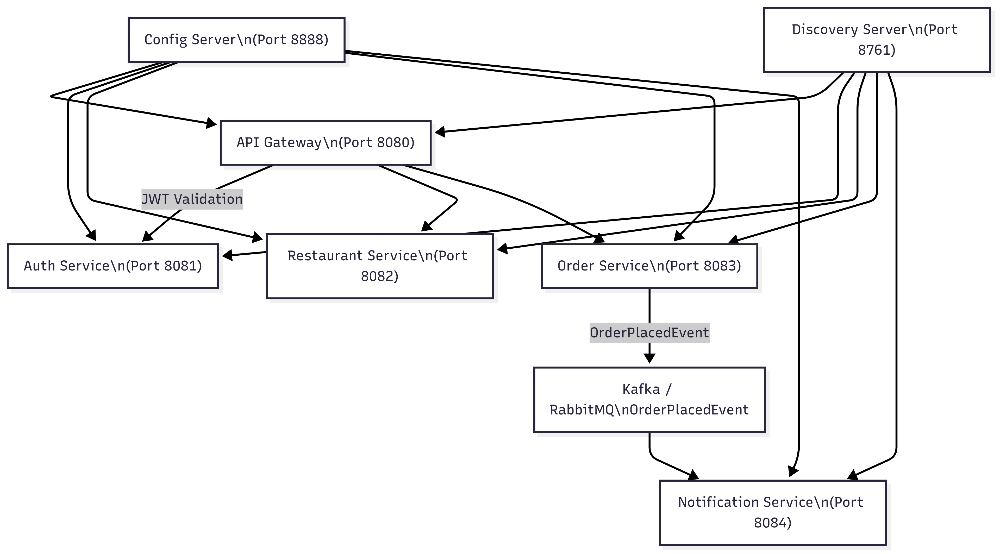
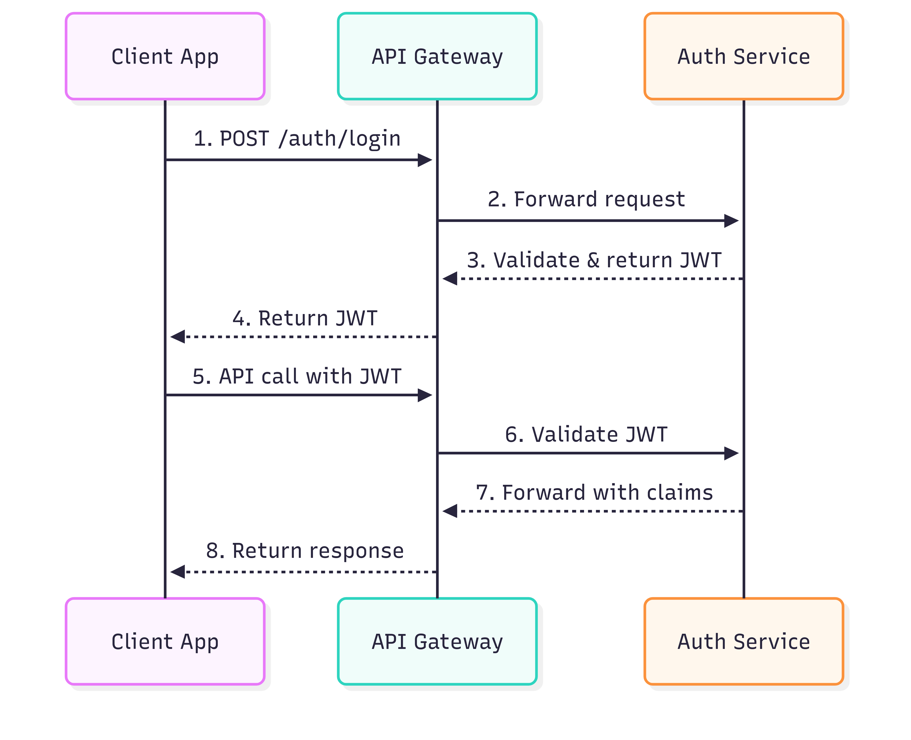

# 🍽️ ByteBites Microservices Platform


## 🧱 Architecture Overview

### 🔗 Core Services

| Service | Description |
| ------- | ----------- |
| **discovery-server** | Eureka service registry |
| **config-server** | Centralized externalized configuration via Git |
| **api-gateway** | Entry point for all services, JWT validation, and routing |
| **auth-service** | User registration, login, and JWT issuance |
| **restaurant-service** | Manages restaurants and menus |
| **order-service** | Handles order creation and status management |
| **notification-service** | Sends notifications after order placement |

---

## 🗺️ Architecture Diagram



## JWT Authentication Flow
  

- Kafka/RabbitMQ Event Flow

---

## 🔐 Authentication & Authorization Flow

1. **Login via Auth-Service**
   - `POST /api/v1/auth/login` returns a JWT
   - OAuth2 login also supported
2. **JWT Handling**
   - Stored on client
   - Sent with every request via `Authorization: Bearer <token>`
3. **API Gateway**
   - Validates JWT
   - Extracts user ID, role, and injects into request headers
4. **Role-Based Access Control**
   - `@PreAuthorize` used in downstream services
5. **Ownership Verification**
   - Services validate resource ownership using user ID from JWT

---

## ▶️ Service Startup Order

1. `discovery-server`
2. `config-server`
3. `auth-service`
4. `restaurant-service`
5. `order-service`
6. `notification-service`
7. `api-gateway`

---

## 🧪 Testing the Platform

### 🔑 JWT Authentication with Postman

1. **Login**
   - `POST /api/v1/auth/login`
   - Body:
     ```json
     {
       "email": "user@example.com",
       "password": "password"
     }
     ```
   - Copy the returned JWT

2. **Use JWT in Header**
   - Add to all requests:
     ```
     Authorization: Bearer <JWT>
     ```

---

### 🔄 Flows to Test

#### 🧍‍♂️ Registration & Login

- `POST /api/v1/auth/register`
- `POST /api/v1/auth/login`

#### 🍽️ Restaurant Flow

- `POST /api/v1/restaurants` — Add new restaurant (only for owners)
- `GET /api/v1/restaurants` — Public list
- `PUT /api/v1/restaurants/{id}` — Update own restaurant

#### 🛒 Order Flow

- `POST /api/v1/orders` — Place an order (customers only)
- `GET /api/v1/orders` — View own orders or orders for owned restaurants

#### 📩 Notification Flow

- Triggered automatically when an order is placed
- Log or simulate email/push notification in `notification-service`

---


---

## 📡 Kafka / RabbitMQ Events

- `OrderPlacedEvent` is published by `order-service`
- Subscribed by:
  - `restaurant-service` to initiate order preparation
  - `notification-service` to send notifications

---

## ⚙️ Resilience Features

- Implemented via **Resilience4j**
  - Circuit Breaker on all inter-service calls
  - Fallback responses in case of failure
  - Retry and timeout support

---


### ✅ Core Infrastructure
- [ ] `discovery-server`
- [ ] `config-server`
- [ ] `api-gateway`

### ✅ Auth & User Management
- [ ] JWT & OAuth2 login
- [ ] Role-based tokens: `ROLE_CUSTOMER`, `ROLE_RESTAURANT_OWNER`, `ROLE_ADMIN`

### ✅ Microservices
- [ ] `restaurant-service` CRUD
- [ ] `order-service` with status transitions
- [ ] `notification-service` listener

### ✅ Event-Driven Architecture
- [ ] Kafka/RabbitMQ setup
- [ ] Publish/subscribe with event payloads

### ✅ Resilience & Observability
- [ ] Circuit breaker + fallback
- [ ] Swagger & centralized logging

---


